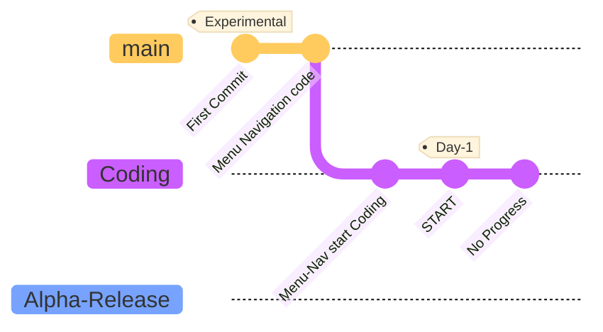

# Custom E-Bike MCU
### Introduction
This is a public repository, If you are likely very interested on this certain project of mine, You can give me suggestions on **Pull Request** Section.

---
My name is **_Quinn Matthew C. Zaballa_** the author and owner of this codebase, I currently **DO NOT** accept help(s) or any related to that word. 
> TL:DR I want to code everything myself.

> technically, You can help me by documenting errors on my codebase and what to make things smaller. id like to be teached not someone code it for me. 
 

## TODO

1. ESP32-Main (BRAIN)
   - CPU 0
     - Handle Motor controls.
     - Speed control algorithms. (Battery + Temp = OUTPUT;)
   - CPU 1
     - Battery Managements
     - Temp monitoring
     - Power Efficiency Calculation (Battery Health + TEMP + Battery % + MODEofDRIVE + PowerUsage = OUTPUT;)
     - Range estimation
    
2. ESP32-Slave
   - CPU 0
     - Environmental Related sensors.
     - Lighting Controls.
    - CPU 1
      - Data logging for better algos.
      - Battery usage optimization (For inclined or heavy things, this is a 6seater)
      - Assistance mode (ECO mode, Auto-Adjust, and Sports mode.)
     
3. Arduino Uno R3
   - CPU 0
     - Real-Time display.
     - User input, Dashboard
     - Warning indicators
     - Throttle feedback.
 

### Menu: TODO
  

4. Menus
   - Vehicle Mode
     - ECO mode
     - Sports mode
     - Auto-Adjust mode
   - Infos
     - Version
     - Codebase Release Version
     - Available Sensors 
   - Settings
     - RFID Registration
     - Sleep mode when idle (Time)
     - Undefined
   - Controls
     - Undefine
   - Sensors
     - DHT11
     - Accel Sensor
     - Proximity Sensor
     - Undefined

 

## TODO: RANK
 

> [!NOTE]
> The Ranking will change and will be noted down in the documentation if ever the code is failing or returning with not expected results.  
> Every Failure and edits has notes and documentation for better understanding on both me and users that are looking at this codebase.

| Rank | Languages |
|-----:|-----------|
|     1| Menu-Navigation|
|     2| Sensors   |
|     3| Dashboard          |
|     4| Controlling the E-Bike   |

  

> [!WARNING]
> This is in experimental stage, IM NOT responsible from accidents or somesort due to sensor, electronics failure. You are complying by using this code YOU ARE responsible from all the damages and etc.

  

### WorkFlow of Electronics

  

**Commit Flow**

 

### Menu-Navigation Flow

